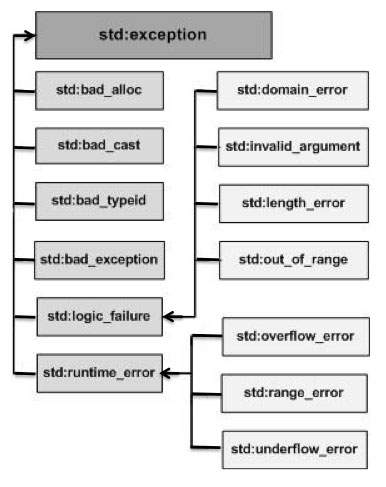

# Try Catch

## Типи виключень

[Джерело](https://www.tutorialspoint.com/cplusplus/cpp_exceptions_handling.htm)

1. **std::exception** -
   An exception and parent class of all the standard C++ exceptions.

2. **std::bad_alloc** -
   This can be thrown by new.

3. **std::bad_cast** -
   This can be thrown by dynamic_cast.

4. **std::bad_exception** -
   This is useful device to handle unexpected exceptions in a C++ program.

5. **std::bad_typeid** -
   This can be thrown by typeid.

6. **std::logic_error** -
   An exception that theoretically can be detected by reading the code.

7. **std::domain_error** -
   This is an exception thrown when a mathematically invalid domain is used.

8. **std::invalid_argument** -
   This is thrown due to invalid arguments.

9. **std::length_error** -
   This is thrown when a too big std::string is created.

10. **std::out_of_range** -
    This can be thrown by the 'at' method, for example a std::vector and std::bitset<>::operator.

11. **std::runtime_error** -
    An exception that theoretically cannot be detected by reading the code.

12. **std::overflow_error** -
    This is thrown if a mathematical overflow occurs.

13. **std::range_error** -
    This is occurred when you try to store a value which is out of range.

14. **std::underflow_error** -
    This is thrown if a mathematical underflow occurs.

### Ієрархія наслідувань виключень
